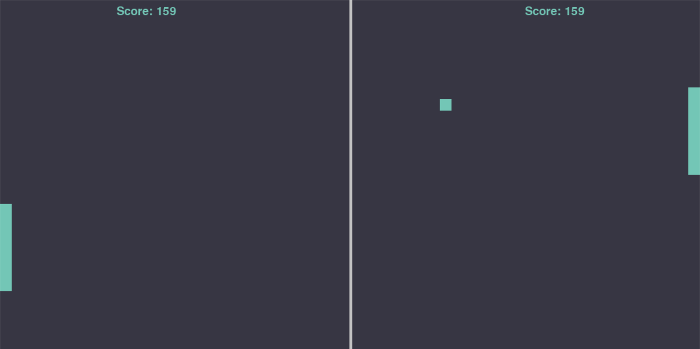

**Pong-AI**:\
 
  Created with the NEAT module, the AI only has two outputs: moving up or down.
By giving it 5 inputs: the y positions of the paddles, y position of the pong, velocity of the pong and the direction of the pong, we get 2 outputs from the neural-network where the AI-player is instructed to either move up or down. 

**Evolution**:\
  We assess the fitness of the genomes with a few factors: their score and how long they stayed alive. Their fitnesses are also reduced if they stay idle when the pong is heading their way in order to encourage them to move around. We were then able to acquire a genome that satisfied the fitness threshold after 22 generations, with 50 players each.

**Viewing the saved genome**:\
  The most recent genome with the highest fitness is saved as “saved_genome.pkl”. To view the genome, simply run the program.

**Evolving your genome**:\
  Should you wish to train your own version of the AI and save it, change “training_mode” to True in line 27 and run. The best genome will be saved to “empty_genome.pkl”.
